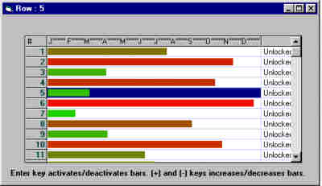



## Bars on MSFlexGrid

### Description

This code shows the basis to manage a drag&drop bars on an MSFlexGrid. This easy source code lets you make the necesary changes to work in companion with my hierarcical msflexgrid. You can make the changs to work the bars to make it vertical. Add pictures,text (anything!) on the bars. Very easy code!
 
### More Info
 
Copy the text, and paste as form1.frm

R1: Changed to ZIP file, a user writes me about problems with ct/paste.

This code assumes that:

1. The rows has the same height.

2. The bar column is not overlapped to the right (Must show complete on screen).

             |
---                |---
**Submitted On**   |2000-05-03 08:49:16
**By**             |[Grenville Tryon](https://github.com/Planet-Source-Code/PSCIndex/blob/master/ByAuthor/grenville-tryon.md)
**Level**          |Beginner
**User Rating**    |4.8 (24 globes from 5 users)
**Compatibility**  |VB 5\.0, VB 6\.0
**Category**       |[Custom Controls/ Forms/  Menus](https://github.com/Planet-Source-Code/PSCIndex/blob/master/ByCategory/custom-controls-forms-menus__1-4.md)
**World**          |[Visual Basic](https://github.com/Planet-Source-Code/PSCIndex/blob/master/ByWorld/visual-basic.md)
**Archive File**   |[CODE\_UPLOAD5455532000\.zip](https://github.com/Planet-Source-Code/grenville-tryon-bars-on-msflexgrid__1-7809/archive/master.zip)

